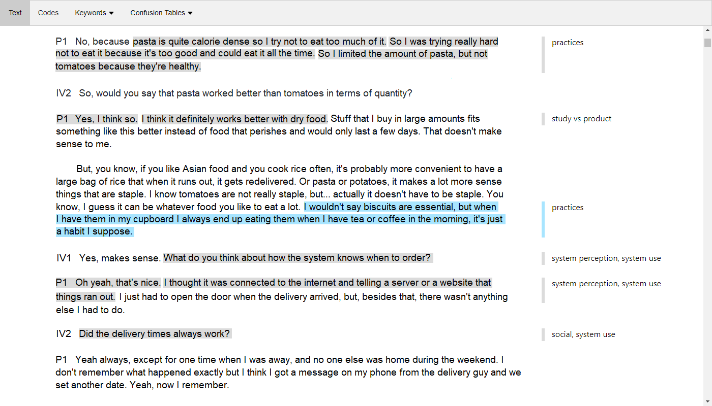

# Thematic Analysis Coding Assistant



Using XGBoost to classify word2vec embeddings and generate interactive coding suggestions.

## How to run the Python script

1) Install libraries. On MacOS:

```
conda env create -f envs/osx_tacaenv.yml
```

On Windows:

```
conda env create -f envs/win_tacaenv.yml
```

2) Install pandas 1.3.0
```
conda install pandas=1.3.0
```
3) Activate conda environment
4) Run the application:

```
python main.py
```
